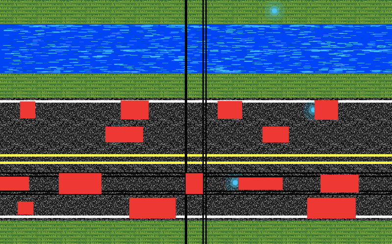

# Frogger 

Version 0.0.1  - September 25th, 2018.

No external libraries are required to run this project.

This is a recreation of Konami's classic "Frogger" video game in Processing. The fundamental goal of the game is the get the frog (frogger) from its initial starting position at the bottom of the screen to a safe spot at the top, meanwhile trying to avoid colliding with vehicles and falling into river water. Use the arrow keys to move the frog one hop UP, LEFT, or RIGHT. Press D to enter debug mode, which allows you to also move DOWN. In debug mode, press < or >, SHIFT+, and SHIFT+., to move to the previous and next scene, respectively.

At the current state of development, my recreation does not yet have logs, turtles, or lily pads floating in the river. Nor does it have images for the vehicles. The game itself is not fully functional yet, as there is no end screen – instead, the game ends once five lives have been lost due to collisions. All around, the game requires significant work before I'm willing to consider it even close to finished.

With that said, the game thus far is functioning as well as I intend it to. Collisions with vehicles result in an appropriate response, as does falling into river water. The basic elements of the game are there and functional (except logs/turtles/lily pads, but these will come very soon). The game works, but it's not at all finished... so, what have I worked on instead? Good question. I can explain. You may note that my program has multiple ("many") classes, when perhaps others have one or a few. You may noticed that, within my project's folder, there are nested folders for scenes with json files and assets. Basically, what I've tried to do is make a modular version of Frogger that allows me to make new levels with ease once the base programming is finished. Because of this, I can easily swap asset files and change the layout of a level, in the end making my program much more scalable.

Each numbered folder in the Scenes directory represents an individual scene. Within those folders, a data.json object describes the name, difficult, and layout of the level, while the Assets folder contains the images that will be used for that level (such as the texture of the road). By changing these assets or the information in data.json, the entire look and feel of a level can be changed. The position of roads, rivers, power-ups, etc (pretty much everything), is based on the layout array defined in data.json. This means that not only are the positions of road rows not hard-coded, as they must be responsive to any change a person makes in data.json, but the position/movement of each car and even each collision are also entirely responsive to changes in data.json. Because of this, everything –– scenes, roads, rivers, cars, river particles, and more –– is treated as an object. For the sake of modularity. Perhaps it's not groundbreaking, but it's definitely not something I've done before.

While I have no intent to monetize my game in any way, I think the practice of making a scalable application has fundamentally challenged the way I normally think when creating a project. Instead of, "How can I make this work in this specific way?" I'm now more concerned with, "How can I make something that, when presented to any average person, gives that person the power to expand on that something in perhaps unexpected ways?" By making Frogger in this way, I've made it so that (if I were ever to release the game to the public) people could add to the game without needing to modify the base code. I'm not sure exactly why, but this is a fascinating idea to me... This (being moddable) is how so many of my childhood games became memorable, so it's very empowering to be able to recreate it.

Created by Stephen Kaplan.

## Sample data.json
** JSON does not support comments, but for the sake of explanation please read all text preceeded by ** as comments

{
	"name": "My Level",
	"difficulty": "Easy",
	"point value": 100,
    "number of powerUps": 4,		** These two lines are unused currently
    "powerUp types":[0,0,1,1],		** They will later control type/usefulness of power-ups in the level
	"layout":[
		"E", "0", "0", "0", "0", "0", "0", "P", "0", "0", "0",		** First index in row = Row type
		"W", "0", "0", "0", "0", "0", "0", "0", "0", "0", "0",		** E = End row, W = River/Water row, S = Safezone Row
		"W", "0", "0", "0", "0", "0", "0", "0", "0", "0", "0",		** R = Road row, B = Beginning row
		"S", "0", "0", "0", "0", "0", "0", "0", "0", "0", "0",
		"R", "1", "-8", "0", "0", "0", "0", "0", "P", "0", "0",		** P (scattered about) = Power-up placed at specific location
		"R", "-1", "-5", "P", "0", "0", "0", "0", "0", "0", "0",
		"R", "3", "0", "0", "0", "0", "0", "0", "0", "0", "0",		** Second index in Road rows = Road Type
		"R", "-1", "10", "0", "0", "0", "P", "0", "0", "0", "0",	** -1 = No lines, 1 = Upper white line, 2 = Lower white line, 3 = Middle yellow lines
		"R", "2", "5", "0", "0", "0", "0", "0", "0", "0", "0",		** Third index in Road rows = # of cars & direction of movement
		"B", "0", "0", "0", "0", "F", "0", "0", "0", "0", "0",		** <0 = Move left, >0 = Move right
	]
}										** F (bottom row) = Initial placement of Frogger

## Images

## Videos

Documentation Video: Coming Soon