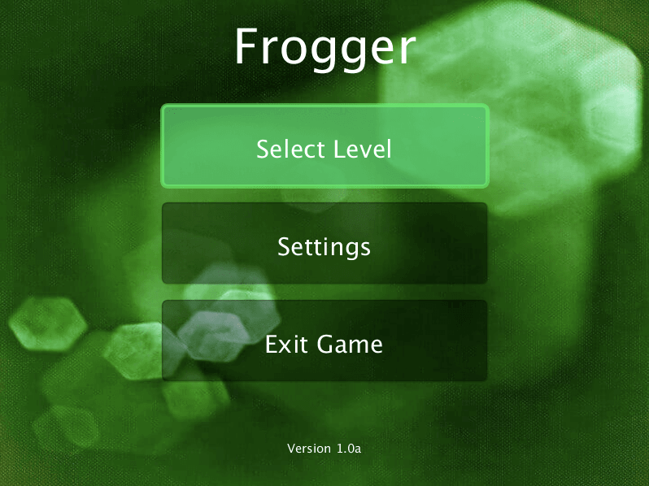
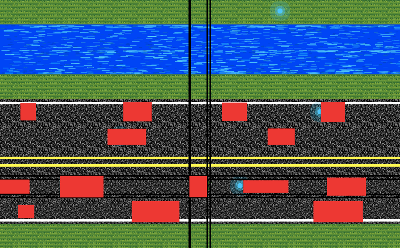

# Frogger

Version 1.0c - October 10th, 2018.

The Minim library for Processing is required to run this project.

This is a recreation of Konami's classic "Frogger" video game in Processing. The fundamental goal of the game is the get the frog (frogger) from its initial starting position at the bottom of the screen to a safe spot at the top, meanwhile trying to avoid colliding with vehicles and falling into river water. Use the arrow keys to move the frog one hop UP, DOWN, LEFT, or RIGHT. Press D to enter debug mode. In debug mode, press < or >, SHIFT+, and SHIFT+., to move to the previous and next scene, respectively.

New since last version are logs, lily pads, images (for all obstacles), sounds, and more. A start menu has been added that allows you to select a level to play. In the settings menu, the user can control the window size as well as turn sounds on or off. Power Ups now give points when jumped on, and endpoints transport frogger to the next level (or trigger a "win game" scenario). A high score is stored for the overall game in data/highscore.json.

Collisions with vehicles result in an appropriate response, as does falling into river water.

You may note that my program has multiple ("many") classes, when perhaps others have one or a few. You may noticed that, within my project's folder, there are nested folders for scenes with json files and assets. Basically, what I've tried to do is make a modular version of Frogger that allows me to make new levels with ease once the base programming is finished. Because of this, I can easily swap asset files and change the layout of a level, in the end making my program much more scalable.

Each numbered folder in the Scenes directory represents an individual scene. Within those folders, a data.json object describes the name, difficult, and layout of the level, while the Assets folder contains the images that will be used for that level (such as the texture of the road). By changing these assets or the information in data.json, the entire look and feel of a level can be changed. The position of roads, rivers, power-ups, etc (pretty much everything), is based on the layout array defined in data.json. This means that not only are the positions of road rows not hard-coded, as they must be responsive to any change a person makes in data.json, but the position/movement of each car and even each collision are also entirely responsive to changes in data.json. Because of this, everything –– scenes, roads, rivers, cars, river particles, and more –– is treated as an object. For the sake of modularity. Perhaps it's not groundbreaking, but it's definitely not something I've done before.

While I have no intent to monetize my game in any way, I think the practice of making a scalable application has fundamentally challenged the way I normally think when creating a project. Instead of, "How can I make this work in this specific way?" I'm now more concerned with, "How can I make something that, when presented to any average person, gives that person the power to expand on that something in perhaps unexpected ways?" By making Frogger in this way, I've made it so that (if I were ever to release the game to the public) people could add to the game without needing to modify the base code. I'm not sure exactly why, but this is a fascinating idea to me... This (being moddable) is how so many of my childhood games became memorable, so it's very empowering to be able to recreate it.


Created by Stephen Kaplan.

## Sample data.json
** JSON does not support comments, but for the sake of explanation please read all text preceded by ** as comments
```
{
	"name": "My Level",
  	"catchPhrase": "This is a phrase",
	"difficulty": "Easy",
	"point value": 100,
  	"colorMode": 0, 							** 0 = light end point, 1 = dark end point
	"layout":[
		"E", "0", "0", "0", "0", "x", "0", "0", "0", "0", "0",		** First index in row = Row type
		"W", "0", "0", "0", "0", "0", "0", "P", "0", "0", "0",		** E = End row, W = River/Water row, S = Safezone Row
		"W", "0", "0", "0", "0", "0", "0", "0", "0", "0", "0",		** R = Road row, B = Beginning row
		"S", "0", "0", "0", "0", "0", "0", "0", "0", "0", "0",		** x = End point
		"R", "1", "-8", "0", "0", "0", "0", "0", "P", "0", "0",		** P (scattered about) = Power-up placed at specific location
		"R", "-1", "-5", "P", "0", "0", "0", "0", "0", "0", "0",
		"R", "3", "0", "0", "0", "0", "0", "0", "0", "0", "0",		** Second index in Road rows = Road Type
		"R", "-1", "10", "0", "0", "0", "P", "0", "0", "0", "0",	** -1 = No lines, 1 = Upper white line, 2 = Lower white line, 3 = Middle yellow lines
		"R", "2", "5", "0", "0", "0", "0", "0", "0", "0", "0",		** Third index in Road rows = # of cars & direction of movement
		"B", "0", "0", "0", "0", "F", "0", "0", "0", "0", "0",		** <0 = Move left, >0 = Move right
	]
}										** F (bottom row) = Initial placement of Frogger
```
To create your own level, copy one of the level folders and increment its name to the appropriate number (You would name it 6 if it is your first custom level). Within this folder you'll find a data.json file and an assets folder. Within the assets folder, you'll find various image files that are descriptively named for clarity. Replace the files as you wish. Note that the game can run functionally without any image files provided in the assets folder, however the Assets folder and its Cars subfolder must be present (even if empty) in order for the game to run. Using the guide shown above, modify the data.json file to customize the layout of your level. By modifying the image files and the layout of your level, you can create your own experience for the player (or for yourself!).

## Images
Start Menu, Settings, Level Selection



Death Messags


Debug Mode


## Videos

Documentation Video: https://www.youtube.com/watch?v=Qb9IaEbrCEc

## Changes Coming Soon
- Original soundtrack
- More levels
- Compressed images
