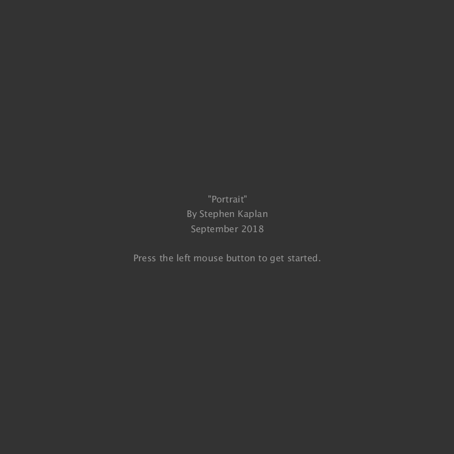

# Self Portrait

This project requires the Processing Sound library. Full volume is recommended if not using headphones, otherwise half volume should be fine.

Left click to generate squares at your mouse's position. These squares, all set at random rotations and a variety of colors, then travel to their predetermined location, in the end creating a coherant image of my face (albeit a stylized pixel version).

Right click to change the hair color. This represents my desire to explore new styles and experiences.

Move the mouse to change the portait's background color.

There is a sound-related error (along the lines of ERROR: /node/set: Synth 837 not found) which I'm not sure how to fix currently. I believe this may be an issue in the Processing Sound library itself, as no such error exists when using Minim.

Created by Stephen Kaplan and inspired by [Jacob Joaquin's](https://www.openprocessing.org/sketch/409770) sketch on [OpenProcessing.org](https://www.openprocessing.org). After deciding what style I was going to use, I wanted my portrait to be more than a static creation – I wanted there to be an element of complexity, which I think is an apt description of my own personality.

## Images

## Videos

[https://youtu.be/icZAP4JzdNQ](https://youtu.be/icZAP4JzdNQ)
